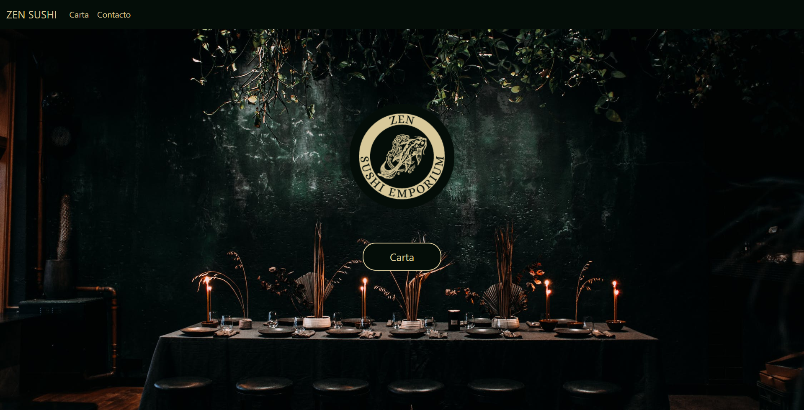
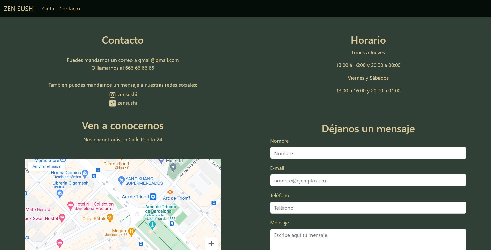

# Bienvenido a mi proyecto

  
Contenido 📝

  <ol>
    <li><a href="#objetivo-🎯">Objetivo</a></li>
    <li><a href="#sobre-el-proyecto-🔎">Sobre el proyecto</a></li>
    <li><a href="#deploy-🚀">Deploy</a></li>
    <li><a href="#stack">Stack</a></li>
    <li><a href="#vistas">Vistas</a></li>
    <li><a href="#futuras-funcionalidades">Futuras funcionalidades</a></li>
    <li><a href="#webgrafia">Webgrafia</a></li>
    <li><a href="#contacto">Contacto</a></li>
  </ol>

## Objetivo 🎯

Este es un proyecto para practicar el diseño web responsive con el framework Bootstrap.

## Sobre el proyecto 🔎

Se trata de crear una web responsive de un restaurante en este caso. Como minimo debe constar de paginas, la home donde se presenta la marca, la pagina de contacto y el menú/carta.

## Deploy 🚀

    ⭐🌟⭐<a href="https://adrip01.github.io/Web-Restaurante-Responsive/"><strong>Url a producción </strong></a>⭐🌟⭐

## Stack

    
    
    

 

## Vistas

Home

<!-- Carta
 -->
Contacto

## Futuras funcionalidades

<!-- ✅ Vista actualizar rutinas   -->

⬜ Carrito de compra 

⬜ Drag and drop

## Webgrafia:

Para conseguir mi objetivo he recopilado información de:

- https://developer.mozilla.org/en-US/
- https://css-tricks.com/snippets/css/a-guide-to-flexbox/
- https://www.w3schools.com/css/default.asp
- https://getbootstrap.com/docs/5.2/getting-started/introduction/

## Contacto

